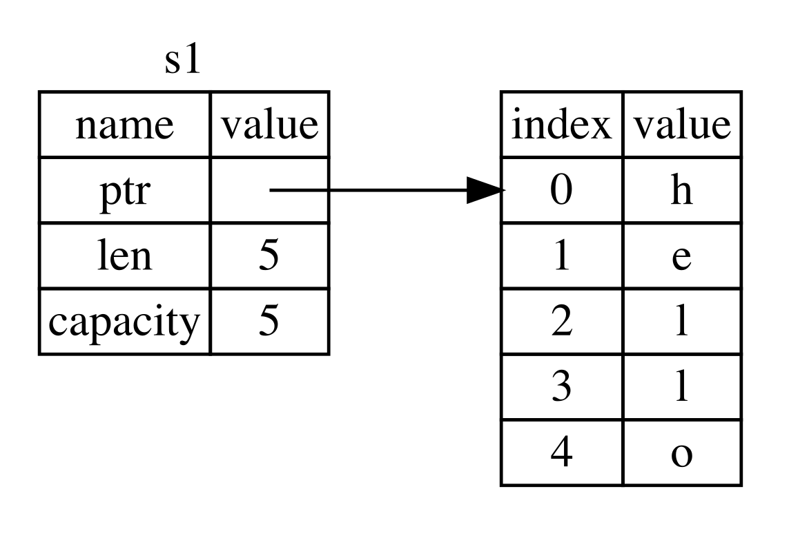
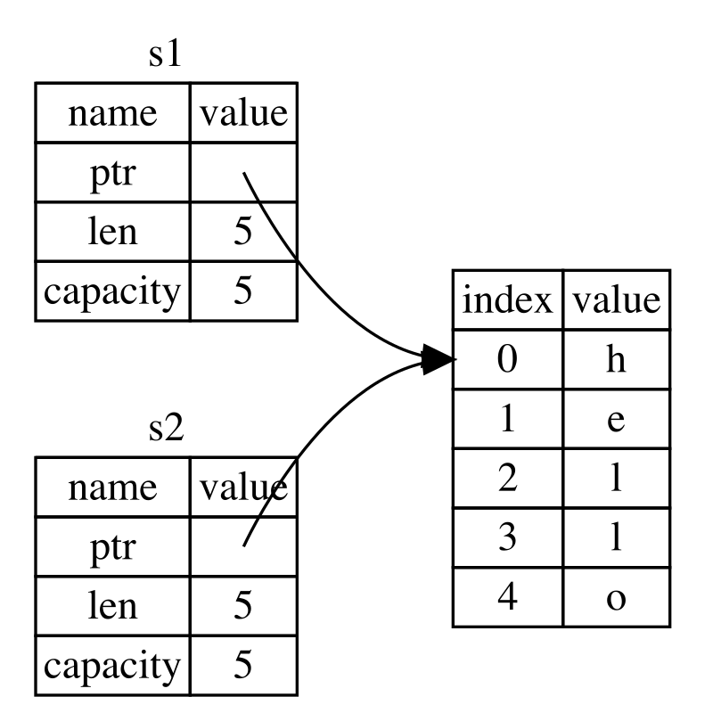
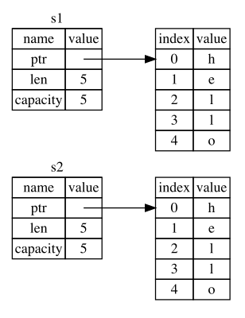
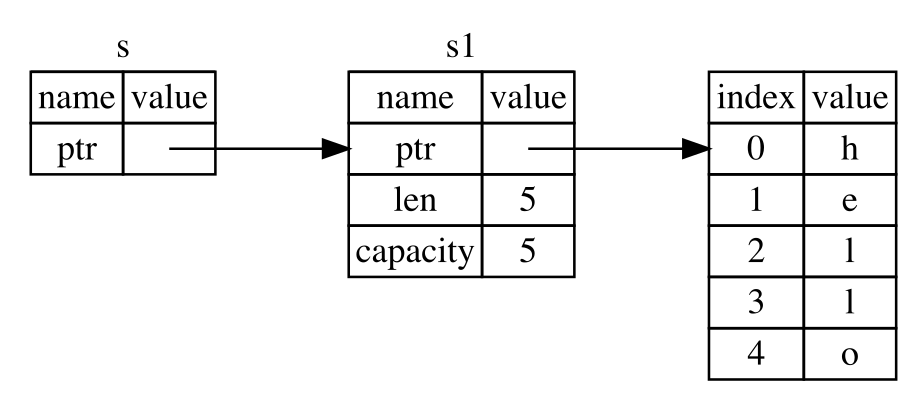

# Memory Models

---

## Memory areas/segments

* **Text Segment**: contains the binary code of the program (Read Only and Shareable)
* **Data Segment**: contains constants and global data (**static** data). Divided in read only and RW sections.
* **Stack**: Stores the value of local variables and values of parameters passed to functions
* **Heap**: Contains **dynamically** allocated memory. (Memory allocated during run time).


---

# For example in Java

```java
int test() {
    // a goes into the stack
    int a = 10;
    
    // item goes into the stack
    // But the Item item points to goes into the heap
    Item item = new Item();
    
    // item2 goes into the stack
    Item item2 = item;
} // <-- The stack pointer is rolled back
```
The `Item` object remains into the **heap** until GC

---

# For example in C

```c
struct Item { int id; int qty }

int test() {
    // a goes into the stack
    int a = 10; 

    // item goes into the stack
    struct Item item = { 10, 10 };    
    
    // item2 goes into the stack
    // But the pointed to Item goes into the heap
    struct Item *item2 = (struct Item*) malloc(sizeof(struct Item)) 
    
    // item3 goes into the stack
    struct Item *item3 = item;
    
    // I need to free the memory allocated from the heap !!!
    free(item2);
    // Beware item3 still points to the freed memory !!!
} <-- The stack pointer is rolled back
```

---

## Equivalent in Rust

```rust
fn test() {
    let a = 10; // a goes into the stack
    
    // item1 goes into the stack
    let item1 = Item { id: 10, qty: 20 };
    
    // item2 is a reference it goes into the stack
    // The data referenced by item2 goes into the heap
    let item2 = Box::new(Item { id: 11, qty: 20 }); 
    
    // item3 goes into the stack
    // now the data is referenced by item3 
    // NOT by item2
    let item3 = item2;
} // <-- The stack pointer is rollbacked 
```

The Rust compiler 'knows' that `item3` **"owns"** the object.
Then when `item3` is removed from the **stack** the value it references is removed from the **heap**

---

## Stack and memory

```Rust
fn fact(n: i64) -> i64{
  println!("n = {n}, Address of n = {:p}", &n);
  
  let res = if n == 1 {1} else {n * fact(n-1)};
  
  println!("fact({n}) = {res}, Address of res = {:p}", &res);
  return res;
}
```
```bash
n = 3, Address of n = 0x16b96d6d8
n = 2, Address of n = 0x16b96d618
n = 1, Address of n = 0x16b96d558
fact(1) = 1, Address of res = 0x16b96d560
fact(2) = 2, Address of res = 0x16b96d620
fact(3) = 6, Address of res = 0x16b96d6e0
```
Look how: `n` address goes down

And then: `res` address goes up

---

##  Ownership and Memory management

* Each value in Rust has an **owner**
* There can only be one owner at a time.
* When the owner goes out of scope, the value will be dropped.

---

## Example with the `String` type

```Rust
let s: &str = "hello";
let mut s1: String = s.to_string(); // String::from(s)

s1.push_str(", world!");
println!("s = {s}");
println!("s1 = {s1}"); 
```
```bash
s = hello
s1 = hello, world!
```

Note:

- `"hello"` is a constant it goes into `static` memory
- `s` is a reference to a 'raw' string (`&str`)
- `s1` is a `String` it holds inside a `&str`

---

## Diagram



After executing: `s1.push_str(", world!");` it will point to a different address

---

## Rust like to move it, move it

```Rust
let mut s1 = "hello".to_string();
s1.push_str(", world!");
println!("s1 = {s1}");

let s2 = s1;           // Ownership moved to s2
println!("s2 = {s2}"); // Ok

println!("{s1}");  // No no...
```

Compiler Output:
```rust
 error[E0382]: borrow of moved value: `s1`
7  |    let mut s1 = "hello".to_string();
   |    ------- move occurs because `s1` has type `String`, which does not implement the `Copy` trait
...
11 |    let s2 = s1;           // Ownership moved to s2
   |    --- value moved here
...
14 |     println!("{s1}");  // No no...
   |               ^^^^ value borrowed here after move
   | 
help: consider cloning the value if the performance cost is acceptable
   |
11 |     let s2 = s1.clone();           // Ownership moved to s2
```

---

## Diagram




In **c** both `s1` and `s2` will point into the same memory area

In **rust** ownership is moved from `s1` to `s2` and `s1` cannot be used anymore

---

## Move vs Copy

```Rust
let mut s1 = "hello".to_string();
println!("s1 = {s1}");

let mut s2 = s1.clone();   // Copy all
println!("s1 address: {:p}, s2 address: {:p}", &s1, &s2);

s2.push_str(", world!");

println!("{s1}");      // No problem now
println!("{s2}");      // s2 != s1
```

```bash
s1 = hello
s1 address: 0x16da66ca8, s2 address: 0x16da66d18
hello
hello, world!
```


---

## Copy Types

* `Copy` types are types that do not `move` ownership, but rather `copy` all the data when assigned  
* The following are `Copy` types:
  * All scalar types: integers, floats, booleans and chars
  * Tuples of scalar types
  * Types that implement `Copy` and `Clone`:

---

## Example

```Rust
#[derive(Debug, Copy, Clone)] // Make Point implement Copy
struct Point {
    x: i32,
    y: i32
}

let p1 = Point { x:10, y: 20 };
let mut p2 = p1; // Copy here
p2.x = 100;

println!("p1 = {p1:?};");
println!("p2 = {p2:?};");
```
```rust
p1 = Point { x: 10, y: 20 };
p2 = Point { x: 100, y: 20 };
```
---

## Move into a function

Suppose you define a function like:

```Rust
fn length1(s: String) -> usize {
    s.len()
}
```

Now let's use it:

```rust
let s1 = String::from("hello");
let len = length1(s1); // s1 is moved into the function
println!("The length of '{s1}' is {len}."); // I cannot use s1 here!
```

---

## Look at the compiler output

```rust
error[E0382]: borrow of moved value: `s1`
  --> src/main.rs:5:29
   |
3  |     let s1 = String::from("hello");
   |         -- move occurs because `s1` has type `String`, which does not implement the `Copy` trait
4  |     let len = length1(s1);
   |                       -- value moved here
5  |     println!("The length of {s1} is {len}");
   |                             ^^^^ value borrowed here after move
   |
note: consider changing this parameter type in function `length1` to borrow instead if owning the value isn't necessary
  --> src/main.rs:34:15
   |
34 | fn length1(s: String) -> usize {
   |    -------    ^^^^^^ this parameter takes ownership of the value
   |    |
   |    in this function
help: consider cloning the value if the performance cost is acceptable
   |
4  |     let len = length1(s1.clone());
   |                         ++++++++
```

---

## You can solve it using a Reference (Borrowing)

Change the type of `s` from `String` to `&String`
```Rust
fn length2(s: &String) -> usize {
    s.len()
}
```
Change the invocation
```rust
let s1 = String::from("hello");

let len = length2(&s1); // <-- Here

println!("The length of '{s1}' is {len}.");

```
> Borrow definition (Oxford Dictionary): 
> 
> Take and use (something belonging to someone else)
> with the intention of returning it.

---

## Diagram


---

## Rules for references

* You can have any number of **immutable** references
* You can have **only** one **mutable** reference, excluding also **inmutable** ones.
* References should be valid (You cannot keep a reference to an out of scope value).

---

## Play with references

```Rust
let mut s = String::from("hello");

let r1 = &s; // no problem
let r2 = &s; // no problem
println!("r1 = {} and r2 = {}", r1, r2);

let r3 = &mut s; // no problem if I do not use r1 or r2 anymore
r3.push_str(" world");
println!("r3 = {}", r3);

let r4 = &mut s; // no problem if I do not use r3 anymore
r4.push_str(" world");
println!("r4 = {}", r4);

s.push_str(" world");

// If I try to use r1, r2, or r3 here I'll get an error
// For example: println!("r1 = {} and r2 = {}", r1, r2); // Wrong !
```
---

## Examples

### Invalid, mixing mutable and immutable


```Rust
let mut s = String::from("hello");

let r1 = &s; // no problem
let r2 = &s; // no problem
println!("r1 = {} and r2 = {}", r1, r2);

let r3 = &mut s; // Mixing
r3.push_str(" world");
println!("r3 = {}", r3);

let r4 = &s;

// Remove comments and try
// println!("r1 = {} and r2 = {}", r1, r2);
// println!("r3 = {}", r3);

println!("r4 = {}", r4);

```
[Playground Link](https://play.rust-lang.org/?version=stable&mode=debug&edition=2021&gist=503a4b77c8aadccca0724cd42dcc7994)

---

## Examples

### Invalid, "dangling" reference


```Rust
{ 
    let s1 =  String::from("hello");
    let mut r1 = &s1;
    println!("{r1}"); // r1 
    {
        let s2 =  String::from("world");
        r1 = &s2; // <-- `s2` does not live long enough
        println!("{r1}"); // r1 
    }
    println!("{r1}"); // r1 
    
}

```

[Playground link](https://play.rust-lang.org/?version=stable&mode=debug&edition=2021&gist=70cae4d073f647e6b9e70c2ea909a88f)

---

## Summary

* Memory areas: **text**, **data**, **stack** and **heap**
* Diff. between GC languages (Java, etc) & Manual mm (Rust, C, etc.)
* Move (transfer ownership)
    - Each value has **one** owner
    - When owner goes out of scope the value is dropped
* Copy (create a new value)
* Borrowing (Reference to the original value):
    - Mutable (1 and only 1) & Immutable (many)
    - References should always point to valid values.

---